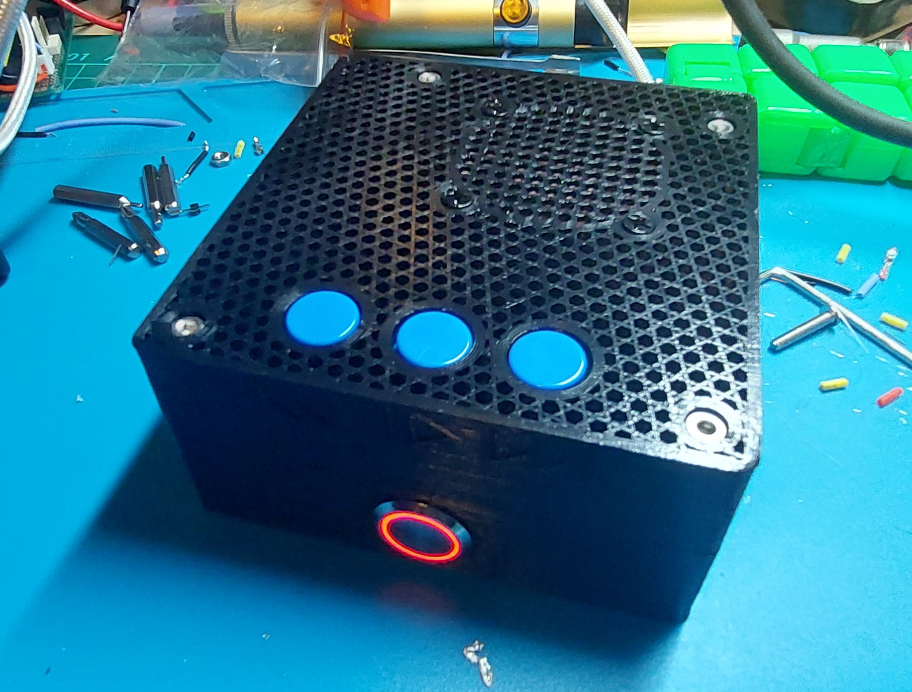

# Volumio box files for 3D printing

## Links
[Top Box stl](stl/volumio_top.stl)

[Bottom Box stl](stl/volumio_bottom.stl)

## Gallery
Printed with 40% Stars infill and 0 bottom and top solid layers.

